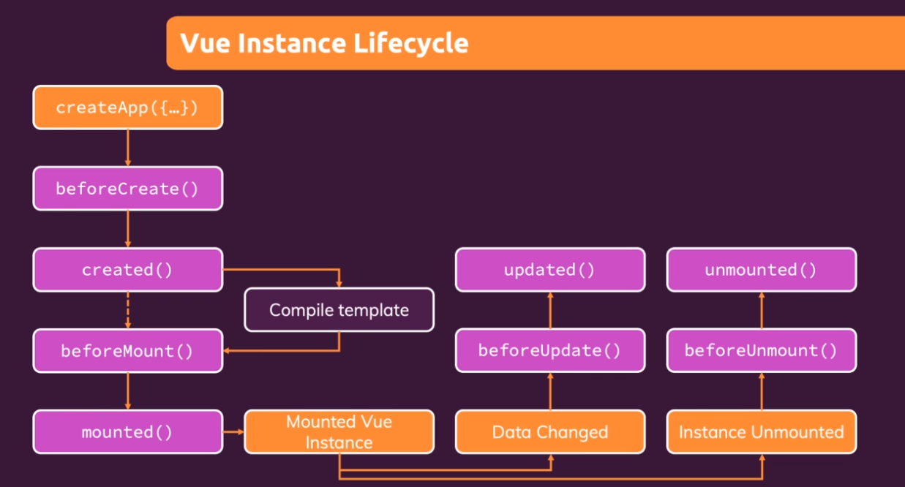

# Vue Bootcamp

1. Vue.js is a Javascript framework
   - Makes building interactive and reactive web frontends easier
   - For the browser (front-end)
1. What is Javascript?
   - A programming language supported by all browsers
   - Allows you to manipulate the already running page and provide richer user experiences
1. What is a framework?
   - A (third-party) library that exposes utility and functionality, and a set of rules
1. Reactive
   - App is able to react to user input, update the screen dynamically
1. Web frontends
   - 'What the user sees'
   - HTML + css + js in the browser
1. We don't send requests back and forth to the server to update the screen
   - We use JS instead

## Ways of Using Vue

1. Used to control parts of HTML pages, or entire pages
   - Don't have to use it for the whole page
   - 'Widget' approach on a multi-page app
   - (Some) pages are still rendered on and served by a backend server
1. Can be used to control the entire frontend of a web app
   - SPA approach
   - Server only sends one HTML page
   - Vue takes over after and controls the UI

## Vue Alternatives

1. React.js
   - Lean and focused component-based UI library (not a framework)
   - Certain features (routing) are added via community packages
1. Angular
   - Complete component-based UI
   - Lots of features
   - Uses TypeScript
   - Can be overkill for smaller projects

## Getting Started

1. [Vuejs Quick Start](https://vuejs.org/guide/quick-start.html)
1. Without Build Tools
   ```html
   <script src="https://unpkg.com/vue@3"></script>
   ```

## Connecting a vue app to a section of html

```html
<section id="user-goal">
	<h2>My Course Goal</h2>
	<p>{{ courseGoal }}</p>
</section>
```

```js
const app = Vue.createApp({
	data() {
		return {
			courseGoal: 'Finish the course and learn Vue.',
		};
	},
});

app.mount('#user-goal');
```

- We are also using Interpolation and Data Binding
  - {{ courseGoal }}
- It will only work within the section we have defined for vue

# DOM Interaction with Vue

## Interpolation

```html
<section id="user-goal">
	<h2>My Course Goal</h2>
	<p>{{ courseGoal }}</p>
	<p>Learn more <a v-bind:href="vueLink">about Vue</a>.</p>
</section>
```

```js
const app = Vue.createApp({
	data() {
		return {
			courseGoal: 'Finish the course and learn Vue.',
		};
	},
});
```

- Simple example of including an interpolated value in the hmtl from vue

## Data Binding

```html
<section id="user-goal">
	<h2>My Course Goal</h2>
	<p>Learn more <a v-bind:href="vueLink">about Vue</a>.</p>
</section>
```

```js
const app = Vue.createApp({
	data() {
		return {
			vueLink: 'https://vuejs.org',
		};
	},
});
```

- `v-bind` works with any html tag an element has

## Methods

```html
<section id="user-goal">
	<h2>My Course Goal</h2>
	<p>{{ outputGoal() }}</p>
</section>
```

```js
const app = Vue.createApp({
	methods: {
		outputGoal() {
			const randomNumber = Math.random();

			if (randomNumber < 0.5) {
				return this.courseGoalA;
			} else {
				return this.courseGoalB;
			}
		},
	},
});
```

## Event Binding

- Binding an html event to a function through vue

```html
<section id="events">
	<h2>Events in Action</h2>
	<input type="text" v-on:input="setName1($event, 'Hake')" />
	<input type="text" v-on:input="setName2" />
	<p>Your Name: {{ name }}</p>
</section>
```

```js
const app = Vue.createApp({
	data() {
		return {
			name: '',
		};
	},
	methods: {
		setName1(event, lastName) {
			this.name = event.target.value + ' ' + lastName;
		},
		setName2() {
			this.name = event.target.value;
		},
	},
});
```

- By default the event is passed through to the function
- But if you need to pass additional variables in, you have to manually pass the event by `$event`

## Event Modifiers

- Really, just limiting when an event is triggered

```html
<section id="events">
	<h2>Events in Action</h2>
	<button v-on:click="add(10)">Add 10</button>
	<button v-on:click.right="reduce(5)">Reduce 5</button>
	<p>Result: {{ counter }}</p>
	<input
		type="text"
		v-on:input="setName($event, 'Hake')"
		v-on:keyup.enter="confirmName"
	/>
	<p>Your Name: {{ confirmedName }}</p>

	<form v-on:submit.prevent="submitForm">
		<input type="text" />
		<button>Sign Up</button>
	</form>
</section>
```

- Notice the `v-on:click.right`, `v-on:keyup.enter`, and `v-on:submit.prevent`

## Data Binding + Event Binding = Two-Way Binding

- These two are equivalent
- The better way is to simply use two way data binding with `v-model`

```html
<input type="text" v-bind:value="name" v-on:input="setName($event, 'Hake')" />
```

```html
<input type="text" v-model="name" />
```

## Computed Properties

- When you need a function that really only outputs
- This allows us to use a function that is only called when the property used is changed

```html
<p>Your Name: {{ fullname }}</p>
```

```js
computed: {
	fullname() {
		if (this.name === '') {
			return '';
		}

		return this.name + ' ' + 'Hake';
	},
},
```

## Watchers

Similar to a computed property

The big difference is, you use watchers if you want a value to change based on some logic

```js
data() {
		return {
			counter: 0,
			name: '',
			lastName: '',
			//fullname: '',
		};
	},
	watch: {
		counter(value) {
			if (value > 50) {
				this.counter = 0;
			}
		},
	},
```

The function in the watch section should match the property

## Methods vs Computer vs Watch

1. Methods
   - Use with event binding OR data binding
   - Data binding: method is executed for eery 're-render' cycle of the component
   - User for events or data that really needs to be re-evaluated all the time
1. Computed
   - Use with data binding
   - Only re-evaluated if one of their 'used values' changed
   - Use dor data that depends on other data
1. Watch
   - Not used directly in template
   - Allows you to run any code in reaction to some changed data (send http request)
   - Use for any non-data update y ou want to make

## v-bind and v-on Shorthand

You can use the `@` symbol instead of `v-on`

```html
<button v-on:click="add(10)">Add 10</button>
<button @click="add(10)">Add 10</button>
```

You can use the `:` symbol instead of `v-bind:`

```html
<input type="text" v-bind:value="name" /> <input type="text" :value="name" />
```

Be consistent (use one or the other)

## Styling

Reference 02-04

# Rendering Conditional Content & Lists

## Render Conditional Content

```html
<p v-if="goals.length === 0">
	No goals have been added yet - please start adding some!
</p>
```

We can add this directly into the html page

`v-else` is an option, but it must come after an element that has `v-if`

```html
<p v-if="goals.length === 0">
	No goals have been added yet - please start adding some!
</p>
<ul v-else-if="goals.length > 0">
	<li>Goal</li>
</ul>
<p v-else></p>
```

You can't have anything in-between you if, else-if, else elements

## v-show

`v-if`alternative

- v-if won't add items to the DOM
- v-show just hides the elements

## v-for

```html
<ul v-else>
	<li v-for="goal in goals">{{ goal }}</li>
</ul>
```

- You only have access to `goal` inside the list element
- You can also loop through an object:

```html
<ul>
	<li v-for="(value, key, index) in {name: 'Gary', age: 31}">
		{{ key }}: {{ value }} - {{ index }}
	</li>
</ul>
```

- Or a range of numbers

```html
<ul>
	<li v-for="num in 10">{{ num }}</li>
</ul>
```

# Vue Behind the Scenes

## Reactivity Under the Hood

Vue uses a built-in javascript object called `Proxy`

```js
const data = {
	message: 'Hello',
	longMessage: 'Hello World!',
};

const handler = {
	set(target, key, value) {
		if (key === 'message') {
			target.longMessage = value + ' World';
		}
		target.message = value;
	},
};

const proxy = new Proxy(data, handler);

proxy.message = 'Hello!!!';

console.log(proxy.longMessage);
```

This allows you to make objects and properties reactive

## Multiple Vue Apps

You can create multiple vue apps in an application

```html
<section id="app2">
	<p>{{ favoriteMeal }}</p>
</section>
```

```js
const app2 = Vue.createApp({
	data() {
		return {
			favoriteMeal: 'Pizza',
		};
	},
});

app2.mount('#app2');
```

- You can't reference anything from a different app in the app2
- One 'html part' per app
  - Official term is `Template`

## Template Alternative

```html
<section id="app2"></section>
```

```js
const app2 = Vue.createApp({
	template: `
    <p>{{ favoriteMeal }}</p>
  `,
	data() {
		return {
			favoriteMeal: 'Pizza',
		};
	},
});
```

## refs

```html
<input type="text" ref="userText" />
```

```js
methods: {
	saveInput(event) {
		this.currentUserInput = event.target.value;
	},
	setText() {
		//this.message = this.currentUserInput;
		this.message = this.$refs.userText.value;
	},
}
```

- `$refs` is a built in vue object
- It allows you to reference anything defined in the DOM
  - In this case `userText`

## How Vue Updates the DOM

- Vue Instance
  - Stores data, computer properties, methods
  ```js
  title: 'Hello',
  text: 'Not the title'
  ```
  - Data and computed properties may change
  - Because of user input
- Browser DOM
  - Vue-controlled template is rendered in the DOM
  ```html
  <h2>Hello!</h2>
  <p>Not the title</p>
  ```
  - Updates should be reflected, but Vue should **not** re-render everything
- Virtual DOM

  - JS-based DOM which exists only in memory
  - Updates are made to the virtual DOM first, only differences are then rendered to real DOM

## Vue Instance Lifecycle



# Vue CLI and Development Setup

1. [NodeJs](https://nodejs.org/en/) needs to be installed
   ```node
   npm init vue
   ```
   - You can click 'no' on most options
1. [Volar VS Code Extension](https://github.com/johnsoncodehk/volar)
1. Start the app
   ```node
   npm run dev
   ```
1. Vue files now have the `.vue` Extension
   - We also will include html, styling, and javascript all in one file
   - Vue files will be broken into self contained components

# Components

- FriendContact Component

```vue
<template>
	<li>
		<h2>{{ friend.name }}</h2>
		<button @click="toggleDetails">
			‌{{ detailsAreVisible ? 'Hide' : 'Show' }} Details
		</button>
		<ul v-if="detailsAreVisible">
			<li><strong>Phone:</strong> {{ friend.phone }}</li>
			<li><strong>Email:</strong> {{ friend.email }}</li>
		</ul>
	</li>
</template>

<script>
	export default {
		data() {
			return {
				detailsAreVisible: false,
				friend: {
					id: 'manuel',
					name: 'Manuel Lorenz',
					phone: '0123 045678 90',
					email: 'manuel@localhost.com',
				},
			};
		},
		methods: {
			toggleDetails() {
				this.detailsAreVisible = !this.detailsAreVisible;
			},
		},
	};
</script>
```

- App.vue

```vue
<script setup>
	import FriendContact from './components/FriendContact.vue';
</script>

<template>
	<section>
		<header>
			<h1>My Friends</h1>
		</header>

		<ul>
			<FriendContact />
			<FriendContact />
		</ul>
	</section>
</template>
```

## Props

This is how we can pass data from a parent to a child component

- FriendContact.vue

```vue
<template>
	<li>
		<h2>{{ name }} {{ friendIsFavorite === '1' ? '(Favorite)' : '' }}</h2>
		<button @click="toggleFavorite">Toggle Favorite</button>
		<button @click="toggleDetails">
			‌{{ detailsAreVisible ? 'Hide' : 'Show' }} Details
		</button>
		<ul v-if="detailsAreVisible">
			<li><strong>Phone:</strong> {{ phoneNumber }}</li>
			<li><strong>Email:</strong> {{ emailAddress }}</li>
		</ul>
	</li>
</template>

<script>
	export default {
		props: ['name', 'phoneNumber', 'emailAddress', 'isFavorite'],
		data() {
			return {
				detailsAreVisible: false,
				friendIsFavorite: this.isFavorite,
			};
		},
	};
</script>
```

- App.vue

```vue
<ul>
	<FriendContact
		name="Manuel Lorenz"
		phone-number="01234 78992"
		email-address="manuel@localhost.com"
		is-favorite="1"
	/>
	<FriendContact
		name="Julie Jones"
		phone-number="0987 6542"
		email-address="julie@localhost.com"
		is-favorite="0"
	/>
</ul>
```

1. You define your data in the parent (app.vue) file
1. Vue is one directional with props
   - You should not update (can't really) data in the child component
1. A way around it, is to copy the data from the parent with a child specific data value
   ```js
   data() {
   		return {
   			detailsAreVisible: false,
   			friendIsFavorite: this.isFavorite,
   		};
   	},
   ```
   - Then use this value `friendIsFavorite` in the child component

## Props Validation

[Official Docs](https://vuejs.org/guide/components/props.html)

```js
props: {
	name: {
		type: String,
		required: true,
	},
	phoneNumber: {
		type: String,
		required: true,
	},
	emailAddress: {
		type: String,
		required: true,
	},
	isFavorite: {
		type: String,
		required: false,
		default: '0',
		validator: function (value) {
			return value === '1' || value === '0';
		},
	},
},
```

1. This is an alternative way to define props as opposed to listing in an array
1. Define type, if it's required, default (if not required), and validation function
1. Any JS type is supported (String, Number, Boolean, Array, Object, Date, Function, Symbol)

## Emitting Custom Events

1. This allows a child to tell a parent to update data
1. The child doesn't update anything, simply has the parent do it

- FriendContact
- `this.$emit` will expose an event you can bind to

```js
methods: {
	toggleFavorite() {
		this.$emit('toggle-favorite', this.id);
	},
},
```

- App
- `@toggle-favorite` is the event we exposed above

```vue
<FriendContact
	v-for="friend in friends"
	:key="friend.id"
	:id="friend.id"
	:name="friend.name"
	:phone-number="friend.phone"
	:email-address="friend.email"
	:is-favorite="friend.isFavorite"
	@toggle-favorite="toggleFavoriteStatus"
/>
```

```js
methods: {
	toggleFavoriteStatus(friendId) {
		const friend = this.friends.find((x) => x.id === friendId);
		friend.isFavorite = !friend.isFavorite;
	},
},
```

## Provide & Inject

- When you have components that are mainly just containers for other components
  - 'pass-through' components
- `props` and custom events should be the default
  - `provide` and `inject` are the exceptions
  - It makes the code leaner, but makes it harder to understand

### Provide

- This is where you will 'provide' the data in a parent component

```js
provide: {
    topics: [
      {
        id: 'basics',
        title: 'The Basics',
        description: 'Core Vue basics you have to know',
        fullText:
          'Vue is a great framework and it has a couple of key concepts: Data binding, events, components and reactivity - that should tell you something!',
      },
      {
        id: 'components',
        title: 'Components',
        description:
          'Components are a core concept for building Vue UIs and apps',
        fullText:
          'With components, you can split logic (and markup) into separate building blocks and then combine those building blocks (and re-use them) to build powerful user interfaces.',
      },
    ],
  },
```

- Typing provide to `data`

```js
provide() {
    return {
      topics: this.topics,
    };
  },
```

- Defined in data, referenced in provide

## Inject

- In a child component, you inject the item you defined in the parent's `provide`
- Doesn't need to be a direct parent/child. Just an ancestor

```js
export default {
	inject: ['topics'],
	emits: ['select-topic'],
};
```

- You can do the same with functions as well
  - The whole idea is to create a 'hook' in a parent component for a child to connect to

## Global vs Local Components

1. Global are registered on the `main.js` class
   ```js
   app.component('the-header', TheHeader);
   app.component('base-badge', BaseBadge);
   app.component('badge-list', BadgeList);
   app.component('user-info', UserInfo);
   ```
   - These are all loaded when the app loads
   - Could be a very long list if the app is large
1. Local Components
   ```js
   export default {
   	components: {
   		'the-header': TheHeaderVue,
   	},
   	data() {}
   ```

## Scoped Styles

1. Putting a style section on a component, makes all of those styles Global
1. Sytles defined in App.vue, this makes sense (they should be global)
1. But styles defined in a compnent should be Scoped
   ```html
   <style scoped></style>
   ```

# Slots

This is a way to make shareable (with styles) sections for a component

## Slot Definition

```vue
<template>
	<div><slot></slot></div>
</template>

<style scoped>
	div {
		margin: 2rem auto;
		max-width: 30rem;
		border-radius: 12px;
		box-shadow: 0 2px 8px rgba(0, 0, 0, 0.26);
		padding: 1rem;
	}
</style>
```

- Notice the `<slot></slot>`
- You can name Slots
- Only one can be un-named and that will be the default slot

```vue
<template>
	<div>
		<header>
			<slot name="header"></slot>
		</header>
		<slot></slot>
	</div>
</template>
```

## Usage

```vue
<template>
	<section>
		<BaseCardVue>
			<header>
				<h3>{{ fullName }}</h3>
				<BaseBadgeVue :type="role" :caption="role.toUpperCase()" />
			</header>
			<p>{{ infoText }}</p>
		</BaseCardVue>
	</section>
</template>
```

- Using named slots

```vue
<template>
	<section>
		<BaseCard>
			<template v-slot:header>
				<h2>Available Badges</h2>
			</template>

			<template #default>
			<template v-slot:default>
				<ul>
					<li>
						<BaseBadge type="admin" caption="ADMIN" />
					</li>
					<li>
						<BaseBadge type="author" caption="AUTHOR" />
					</li>
				</ul>
			</template>
		</BaseCard>
	</section>
</template>
```

- `v-slot:default` is not required, but it does make it obvious
- `#default` is an alternative to `v-slot:default`

## Default Content in Slots

You can add default content to a slot that will be rendered if it isn't targeted on a component

```vue
<template>
	<div>
		<header>
			<slot name="header">
				<h2>The Default</h2>
			</slot>
		</header>
		<slot></slot>
	</div>
</template>
```

If you reference the component that has the slots, but not the slot itself, it will render the default

```vue
<template>
	<section>
		<BaseCard>
			<template v-slot:default>
				<ul>
					<li>
						<BaseBadge type="admin" caption="ADMIN" />
					</li>
					<li>
						<BaseBadge type="author" caption="AUTHOR" />
					</li>
				</ul>
			</template>
		</BaseCard>
	</section>
</template>
```

## Scoped Slots

- The whole idea of a scoped slot is having a slot defined in a component where the data is also located
- So, you need a way to use the data in the slot component when calling It

### Scoped Slot Component

```vue
<template>
	<ul>
		<li v-for="goal in goals" :key="goal">
			<slot :item="goal" another-prop="..."></slot>
		</li>
	</ul>
</template>

<script>
	export default {
		data() {
			return {
				goals: ['Finish the course', 'Learn Vue'],
			};
		},
	};
</script>
```

### Using Scoped Slot Component

```vue
<CourseGoals #default="slotProps">
	<h2>{{ slotProps.item }}</h2>
	<p>{{ slotProps['anotherProp'] }}</p>
</CourseGoals>
```

## Dynamic Components

This allows us to load a component based on defined logic:

```vue
<script setup>
	import TheHeader from './components/TheHeader.vue';
	import ActiveGoals from './components/ActiveGoals.vue';
	import ManageGoals from './components/ManageGoals.vue';
</script>

<template>
	<div>
		<TheHeader />
		<button @click="setSelectedComponent('ActiveGoals')">Active Goals</button>
		<button @click="setSelectedComponent('ManageGoals')">Manage Goals</button>

		<component :is="selectedComponent"></component>
	</div>
</template>

<script>
	export default {
		components: {
			ActiveGoals,
			ManageGoals,
		},
		data() {
			return {
				selectedComponent: 'ActiveGoals',
				activeUser: {
					name: 'Gary Hake',
					description: 'Site owner and admin',
					role: 'admin',
				},
			};
		},
		methods: {
			setSelectedComponent(cmp) {
				this.selectedComponent = cmp;
			},
		},
	};
</script>
```

- Usually you don't have to reference you components in the component section in the `script`
- But since we are referencing these by string, we need to

### Keep Dynamic Components Alive

```vue
<KeepAlive>
	<component :is="selectedComponent"></component>
</KeepAlive>
```

## Teleport

Warnings and Errors should be at the top of an html page.

Teleport allows you to move an element:

```vue
<Teleport to="body">
	<ErrorAlert v-if="inputIsInvalid">
		<h2>Input is Invalid!</h2>
		<p>Please enter at least a few characters</p>
		<button @click="confirmError">Ok</button>
	</ErrorAlert>
</Teleport>
```

# Forms

- Big takeaway, use `v-model` over `refs`

```vue
<div class="form-control">
	<label for="age">Your Age (Years)</label>
	<input id="age" name="age" type="number" v-model="userAge" />
</div>
```

- This will cause string problems if you use `ref`
- Can also make it specific to a type like so: `v-model.number=""`

# Sending Http requests

NOTE: The Vue Code on this section (section 12) is using the Options pattern

I wanted to have some examples of options

1. We need a backend, but we aren't going to build our own
1. We are going to use [Firebase](https://console.firebase.google.com/u/0/?pli=1) as a our backend
1. We are going to build a Realtime datababase
   - Easier to use and comes with an api
   - Starting in test mode (no auth)

# Routing: "Multi-Page" SPAs

## Routing Setup

1. Install `vue-router`
   ```
   npm install --save vue-router
   ```
   - Official package from vue team: [Link](https://router.vuejs.org/api/)
1. main.js setup
   ```js
   import { createApp } from 'vue';
   import { createRouter, createWebHistory } from 'vue-router';
   import App from './App.vue';
   import TeamsList from './components/teams/TeamsList.vue';
   import UsersList from './components/users/UsersList.vue';

   const router = createRouter({
   	history: createWebHistory(),
   	routes: [
   		{ path: '/teams', component: TeamsList },
   		{ path: '/users', component: UsersList },
   	],
   });

   const app = createApp(App);

   app.use(router);

   app.mount('#app');
   ```

## Using Routes

1. On the template side, we will be using router components
   ```vue
   <template>
   	<TheNavigation />
   	<main>
   		<RouterView></RouterView>
   	</main>
   </template>
   ```
   ```vue
   <nav>
   	<ul>
   		<li>
   			<RouterLink to="/teams">Teams</RouterLink>
   		</li>
   		<li>
   			<RouterLink to="/users">Users</RouterLink>
   		</li>
   	</ul>
   </nav>
   ```
1. Programatic Routing
   ```js
   import { useRouter } from 'vue-router';

   const router = useRouter();
   const confirmInput = () => {
   	router.push('/teams');
   };
   ```
   - This allows us to navigate from code

## Passing Data with Route Params

1. Define the route
   ```js
   	routes: [
   	{ path: '/teams/:teamId', component: TeamMembers },
   ],
   ```
   - Denoted by a `:`
1. Set up the route dynamically
   ```vue
   <script setup>
   	import { computed } from '@vue/reactivity';

   	const props = defineProps({
   		id: String,
   		name: String,
   		memberCount: Number,
   	});

   	const teamMembersLink = computed(() => {
   		return '/teams/' + props.id;
   	});
   </script>

   <template>
   	<li>
   		<h3>{{ name }}</h3>
   		<div class="team-members">{{ memberCount }} Members</div>
   		<RouterLink :to="teamMembersLink">View Members</RouterLink>
   	</li>
   </template>
   ```
   - RouterLink is where we are dynamically building the route

## Updating Params Data with Watchers

```js
watch(route, (newRoute) => {
	if (newRoute.params.teamId) {
		loadTeamMembers(newRoute);
	}
});
```

- The idea is that we want to do a direct link to a route from a sibling
  - It's easier to explain by example...
  - Route from /teams/t1 to teams/t2
- By itself, vue won't trigger a route update if you do a parallel route shift
- But you can add a watch that will trigger whenever a route is added

## Passing Params as Props

1. This is the preferred way, since it makes your component more reusable
   - You can use it as a dynamic component and route to It
1. With composition api, it's a bit funky to make it work
   - The idea is that you are using a props object instead of a route one
1. Update in main.js
   ```js
   const router = createRouter({
   	history: createWebHistory(),
   	routes: [
   		{ path: '/teams', component: TeamsList },
   		{ path: '/users', component: UsersList },
   		{ path: '/teams/:teamId', component: TeamMembers, props: true },
   	],
   });
   ```
1. Component update
   ```vue
   <script setup>
   	import { inject, ref, watch } from 'vue';
   	import UserItem from '../users/UserItem.vue';

   	const props = defineProps({ teamId: String });

   	const teamName = ref('');
   	const members = ref([]);

   	const teams = inject('teams');
   	const users = inject('users');
   	const loadTeamMembers = (teamId) => {
   		const selectedTeam = teams.find((x) => x.id === teamId);
   		const stMembers = selectedTeam.members;
   		const selectedMembers = [];
   		for (const member of stMembers) {
   			const selectedUser = users.find((x) => x.id === member);
   			selectedMembers.push(selectedUser);
   		}

   		members.value = selectedMembers;
   		teamName.value = selectedTeam.name;
   	};

   	loadTeamMembers(props.teamId);

   	watch(
   		() => props.teamId,
   		(newId) => {
   			loadTeamMembers(newId);
   		}
   	);
   </script>
   ```
1. The major weirdness is with the Watch
   - You have to pass in a function to the props.teamId

## Redirecting and Catch All Routes

Redirecting is very simple. It's defined in your main.js (route definition)

Catch alls are simple too. Just make sure they are the last route defined

```js
const router = createRouter({
	history: createWebHistory(),
	routes: [
		{ path: '/', redirect: '/teams' },
		{ path: '/teams', component: TeamsList },
		{ path: '/users', component: UsersList },
		{ path: '/teams/:teamId', component: TeamMembers, props: true },
		{ path: '/:notFound(.*)', component: NotFound },
	],
});
```

## Nested routes

The idea with nested routes is it allows you to add children to a defined route

```js
const router = createRouter({
	history: createWebHistory(),
	routes: [
		{ path: '/', redirect: '/teams' },
		{
			path: '/teams',
			component: TeamsList,
			children: [{ path: ':teamId', component: TeamMembers, props: true }],
		},
		{ path: '/users', component: UsersList },
		{ path: '/:notFound(.*)', component: NotFound },
	],
});
```

You must add a RouterView to the parent component in order for the child routes to work:

```vue
<template>
	<RouterView></RouterView>
	<ul>
		<TeamsItem
			v-for="team in teams"
			:key="team.id"
			:id="team.id"
			:name="team.name"
			:member-count="team.members.length"
		/>
	</ul>
</template>
```

## Named Routes

```js
const router = createRouter({
	history: createWebHistory(),
	routes: [
		{ path: '/', redirect: '/teams' },
		{
			name: 'teams',
			path: '/teams',
			component: TeamsList,
			children: [
				{
					name: 'team-members',
					path: ':teamId',
					component: TeamMembers,
					props: true,
				},
			],
		},
		{ path: '/users', component: UsersList },
		{ path: '/:notFound(.*)', component: NotFound },
	],
});
```

```vue
<script setup>
	import { computed } from '@vue/reactivity';

	const props = defineProps({ id: String, name: String, memberCount: Number });

	const teamMembersLink = computed(() => {
		//return '/teams/' + props.id;
		return { name: 'team-members', params: { teamId: props.id } };
	});
</script>
```

## Query Parameters

```js
const teamMembersLink = computed(() => {
	return {
		name: 'team-members',
		params: { teamId: props.id },
		query: { sort: 'asc' },
	};
});
```

```js
import { useRoute } from 'vue-router';

const route = useRoute();
console.log(route.query);
```

## Multiple Routes with Named Router Views

This is very similar to slots

Allows us to render specific components based on a route

```js
const router = createRouter({
	history: createWebHistory(),
	routes: [
		{ path: '/', redirect: '/teams' },
		{
			name: 'teams',
			path: '/teams',
			components: { default: TeamsList, footer: TeamsFooter },
			children: [
				{
					name: 'team-members',
					path: ':teamId',
					component: TeamMembers,
					props: true,
				},
			],
		},
		{ path: '/users', components: { default: UsersList, footer: UsersFooter } },
		{ path: '/:notFound(.*)', component: NotFound },
	],
});
```

- We use `components` instead of `component`
- Just like slots, default is the un-named `RouterView`
- Otherwise, we connect through the name

```html
<template>
	<TheNavigation />
	<main>
		<RouterView></RouterView>
	</main>
	<footer>
		<RouterView name="footer"></RouterView>
	</footer>
</template>
```

## Scroll Behavior

Allows us to save exact position, or change position dynamically

`main.js` Route definition

```js
scrollBehavior(to, from, savedPosition) {
	console.log(to, from, savedPosition);

	if (savedPosition) {
		return savedPosition;
	}

	return { left: 0, top: 0 };
},
```

## Navigation Guards

Allows you to do some manual checks when changing routes

There seems to be some nonesense around composition api and vue router

[Official Link](https://router.vuejs.org/guide/advanced/composition-api.html#navigation-guards)

# Animation and Transitions

- In general we use css to do animations and Transitions
- Vue comes w/ some built in functionality to help

```vue
<transition>
	<p v-if="paraIsVisible">This is only sometimes visible...</p>
</transition>
```

This element adds specific class at specific times


```css
.v-enter-from {
	opacity: 0;
	transform: translateY(-30px);
}

.v-enter-active {
	transition: all 0.3s ease-out;
}

.v-enter-to {
	opacity: 1;
	transform: translateY(0);
}

.v-leave-from {
	opacity: 1;
	transform: translateY(0);
}

.v-leave-active {
	transition: all 0.3s ease-in;
}

.v-leave-to {
	opacity: 0;
	transform: translateY(30px);
}
```

- By default, vue uses the same transitions on every element by default
- You can name them with custom names
- Notice the name

```
<Transition name="para">
	<p v-if="paraIsVisible">This is only sometimes visible...</p>
</Transition>
```

```css
.para-enter-from {
	/* opacity: 0;
	transform: translateY(-30px); */
}

.para-enter-active {
	/* transition: all 0.3s ease-out; */
	animation: slide-scale 0.3s ease-out;
}
```

- You can also replace the class w/ custom classes completely

```
<Transition enter-to-class="some-class">
	<p v-if="paraIsVisible">This is only sometimes visible...</p>
</Transition>
```

- **NOTE**
	- Transition can only work when it has one root element within it
	- This also works if you have elements controlled by `v-if`